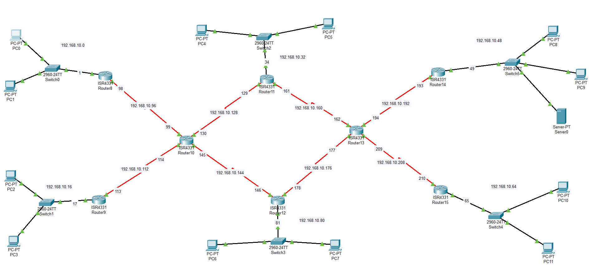

# Multi-Router Network Communication System

A Cisco Packet Tracer project demonstrating communication between multiple networks using routers, switches, PCs, and a server. This project focuses on network design, IP addressing, subnetting, static routing, and connectivity verification in an enterprise-style environment.

---

## Network Topology

**Result:** Successfully established end-to-end communication between multiple LANs through static routing and proper network configuration.

---

## Features

- Multi-router network architecture
- Static routing implementation
- IPv4 subnetting and addressing
- Router and switch configuration
- Inter-network communication
- Connectivity testing and troubleshooting

---

## Technologies Used

- Cisco Packet Tracer
- Cisco ISR4331 Routers
- Cisco 2960 Switches
- TCP/IP
- IPv4 Addressing
- Static Routing

---

## Project Objectives

- Design a scalable network topology.
- Configure routers and switches for inter-network communication.
- Implement static routing between multiple subnets.
- Validate connectivity across the entire network.

---
